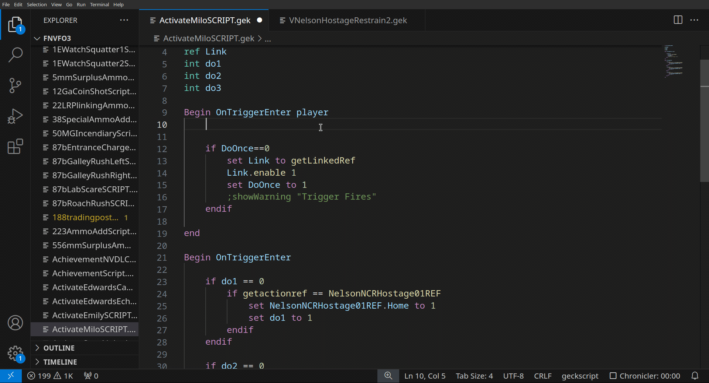
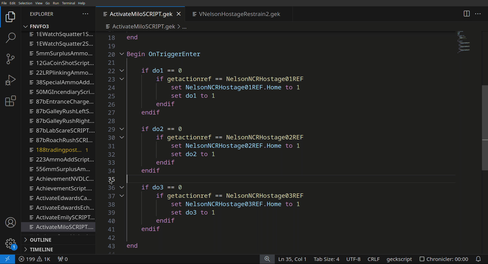
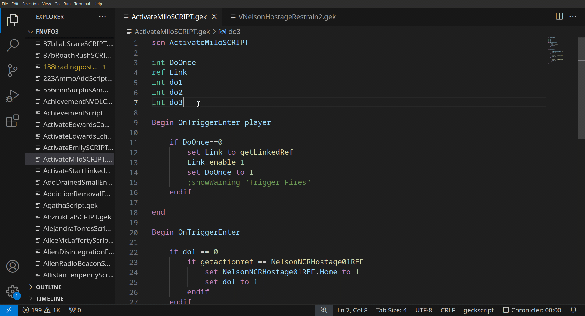
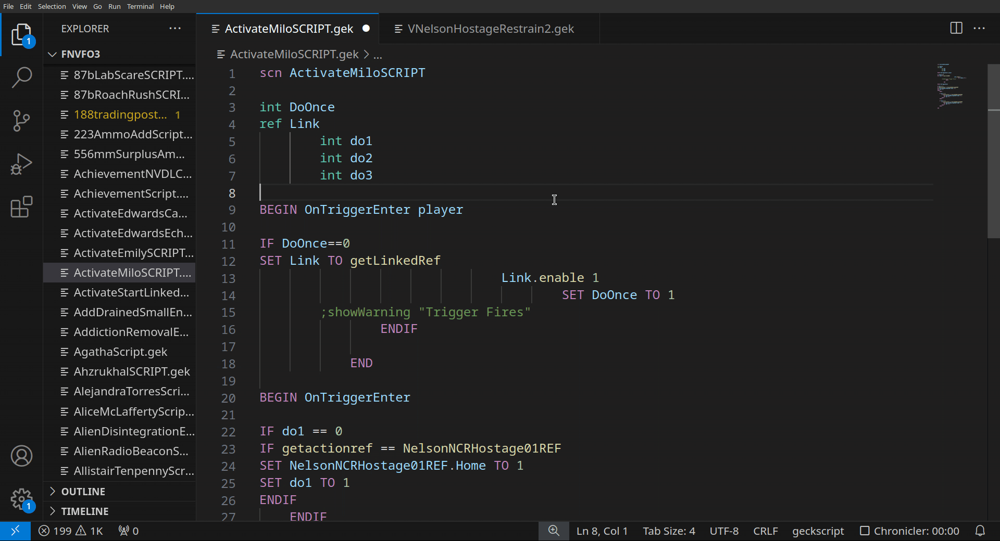
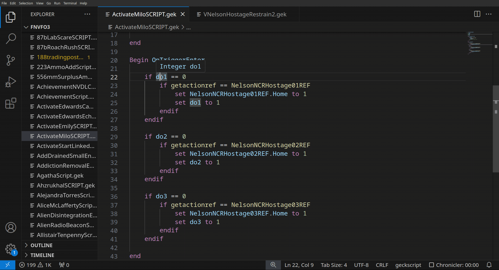
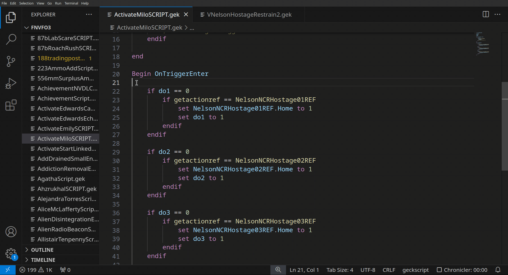
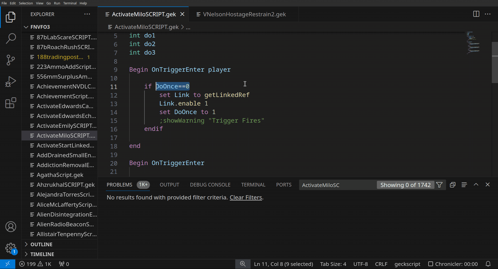
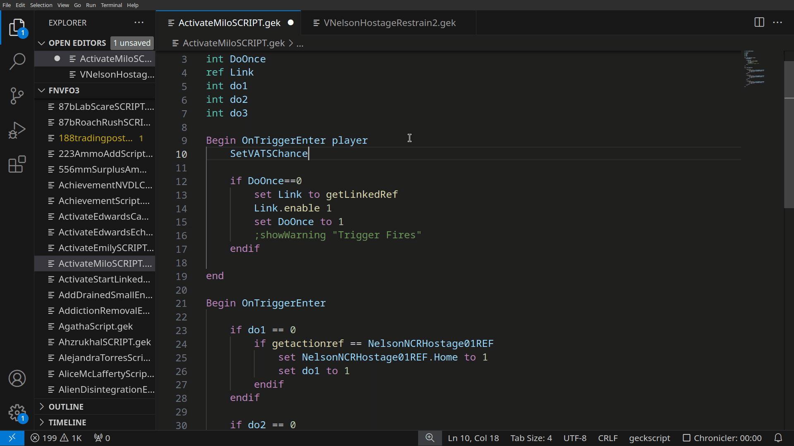

# vscode-geckscript

LSP setup for [geckscript-lsp](https://github.com/WarZone762/geckscript-lsp) and highlighting for geckscript for VSCode

## Installation

Get it on the ~~[Visual Studio Code marketplace](https://marketplace.visualstudio.com/items?itemName=WarZone762.vscode-geckscript)~~(coming soon)
or in [releases](https://github.com/WarZone762/vscode-geckscript/releases)

Also read [installation](https://github.com/WarZone762/geckscript-lsp#Installation)

## Configuration
Refer to [configuration](https://github.com/WarZone762/geckscript-lsp#Configuration)

## Feature Showcase

### code completion

### goto definition

### goto references

### formatting

### rename

### hover

### diagnostics

### sigtature help

